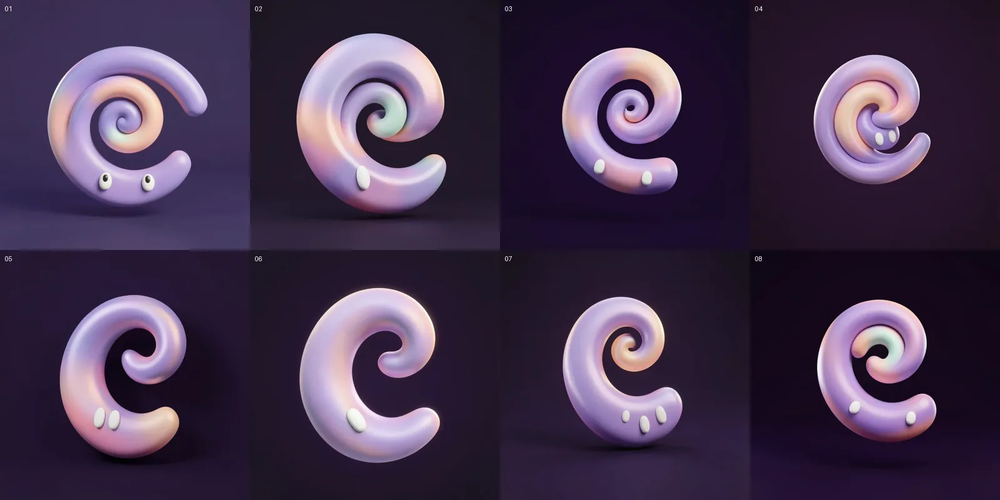

# AI art: Ribbon Spirit stills

A small batch of still images of the Ribbon Spirit, made with an open-weight
image model. They are concept reference and a few still pieces (welcome hero,
empty states). The animated character in the app is code-drawn
(`pinne_flutter/lib/ui/ribbon_spirit/`, see `docs/ribbon-spirit/`); these
images do not replace it and no screen uses them yet.

## Status

| Piece | State | File |
|---|---|---|
| Master character | done, usable | `pinne_flutter/assets/art/ribbon_spirit_master.webp` |
| Master cut-out | done, usable | `pinne_flutter/assets/art/cutout/ribbon_spirit_master.webp` |
| Mood: idle | done, usable (right eye on the inner edge) | `ribbon_spirit_idle.webp`, `cutout/ribbon_spirit_idle.webp` |
| Mood: happy | done, usable but mild (reads as idle plus sparkles) | `ribbon_spirit_happy.webp`, `cutout/ribbon_spirit_happy.webp` |
| Mood: sleepy | done, usable | `ribbon_spirit_sleepy.webp`, `cutout/ribbon_spirit_sleepy.webp` |
| Mood: excited | done, usable | `ribbon_spirit_excited.webp`, `cutout/ribbon_spirit_excited.webp` |
| Welcome hero | done, usable | `ribbon_spirit_welcome.webp`, `cutout/ribbon_spirit_welcome.webp` |
| Empty collection | done, usable | `ribbon_spirit_empty_collection.webp`, `cutout/ribbon_spirit_empty_collection.webp` |
| Empty review queue | done, usable, but the tray reads more like a round tub | `ribbon_spirit_empty_review_queue.webp`, `cutout/ribbon_spirit_empty_review_queue.webp` |
| Search with no results | done, usable | `ribbon_spirit_search_no_results.webp`, `cutout/ribbon_spirit_search_no_results.webp` |

The free ZeroGPU quota ended after 8 generations on 2026-10-06 and after 7
more on 2026-10-07. Seven calls on 2026-10-08 finished the batch without a
quota failure (see [Access and quota](#access-and-quota)).

`pinne_flutter/assets/art/manifest.json` lists every shipped file with its
source generation, seed and size.

## Model and access route

- **Model:** FLUX.2 [klein] 4B, distilled (4 steps), by Black Forest Labs.
  Model card: <https://huggingface.co/black-forest-labs/FLUX.2-klein-4B>
  (revision `e7b7dc27f91deacad38e78976d1f2b499d76a294`). Licence: Apache-2.0.
- **Route:** the official Hugging Face Space
  <https://huggingface.co/spaces/black-forest-labs/FLUX.2-klein-4B>
  (revision `0207e56c7ec73975b6ebeadfaf88c8d338d61a8d`, ZeroGPU), called
  through its public Gradio API (`/infer`) with `gradio_client` 2.7.2 from a
  throwaway virtualenv outside the repo, logged in with the captain's free
  Hugging Face read token. No GPU was used locally.
- **Settings for every call:** mode `Distilled (4 steps)`, 4 steps,
  guidance 1.0, prompt upsampling off, fixed seed (randomize off).
- The Space returns lossy WebP (about 13-20 KB at these sizes). The files are
  kept exactly as returned; there is no upscaling or retouching.

Not used, because their licences are non-commercial: FLUX.2 [dev],
FLUX.2 [klein] 9B, FLUX.1 Kontext [dev], Qwen-Image-2.1.

## Style block

Appended to every prompt, unchanged
(`STYLE` in [`scripts/gen.py`](scripts/gen.py)):

> Style: soft glossy 3D clay render, smooth satin surface with gentle
> subsurface glow, pastel lilac, violet, peach, mint and pink gradients, plain
> deep violet background (#0C0816), soft studio lighting with a subtle rim
> light, centred composition, generous empty space, minimal and friendly, no
> text, no letters, no logo, no lime or yellow-green colour.

## Prompts and seeds

Seed family `4100xx` for the master, all 1024x1024. The exact full prompt of
every call, including failures, is in
[`generation-log.jsonl`](generation-log.jsonl).

**Master v1** (seed 410001):

> A cute character called the Ribbon Spirit: a single thick glossy ribbon that
> curls into a soft spiral swirl, like a satin comma, with two small soft white
> oval eyes near the bottom of the swirl, friendly and calm. Not a monster, not
> an animal, no mouth, no limbs. The ribbon shades from lilac to violet with a
> peach highlight.

v1 drew pupils in the eyes and a lighter, purple-grey background, so v2 asks
for solid eyes and a darker background.

**Master v2** (seeds 410002-410010):

> A cute character called the Ribbon Spirit: a single thick glossy satin ribbon
> that curls into a soft spiral swirl, like a plump comma, with two small solid
> white vertical oval eyes without pupils near the lower part of the swirl,
> friendly and calm. Not a monster, not an animal, no mouth, no limbs. The
> ribbon shades from lilac to violet with soft peach and pink highlights. Very
> dark, almost black violet background.

## Choosing the master



| # | Seed | Verdict |
|---|---|---|
| 01 | 410001 | Rejected: eyes have pupils (googly), background too light |
| 02 | 410002 | Rejected: one eye |
| 03 | 410003 | Rejected: eyes far apart, one on each end of the ribbon |
| 04 | 410004 | Runner-up: cute tucked-in head, but reads as two nested tubes, not one ribbon |
| **05** | **410005** | **Chosen** |
| 06 | 410006 | Rejected: one eye |
| 07 | 410007 | Rejected: three eyes |
| 08 | 410008 | Rejected: eyes far apart |

**Why 05:** it is one unbroken ribbon in a clean comma swirl with a readable
open centre, and its two solid white ovals sit side by side on the thick lower
body, like the flame icon in the inspiration set. The lilac-to-pink-to-peach
gradient stays pastel, the background is the darkest of the set, and there is
no lime. It also has the silhouette closest to the code-drawn spirit (next
section). Weak points: the surface is a round clay tube rather than a flat
satin ribbon, and the image is the Space's lossy WebP, so it should be shown
at phone size, not full-screen on a tablet.

## Compared with the code-drawn spirit

Compared against `docs/ribbon-spirit/gallery.png` (Flutter widget-test
renders on `origin/main` at `f33fad9`).

- **Matches:** the same idea and silhouette: a single comma swirl with an open
  centre, the tail curling in at the top right, and two small white oval eyes
  near the bottom left of the thick lower body. Same dark violet stage and
  pastel family.
- **Differs:** the code spirit is a flatter satin ribbon that tapers to a
  point, wider than tall and slightly tilted, with one palette per spirit
  (violet, lilac, peach, mint, pink or sky). The generated master is an
  upright round tube with a blunt end, mixes lilac, pink and peach in one body,
  and its eyes are larger relative to the body.
- **Use:** close enough to read as the same character family in a still hero
  or empty state, but not close enough to sit next to the animated spirit on
  the same screen as if they were one drawing.

## Mood poses

Every mood is a reference edit (`input_images`) at 1024x1024, seeds 410011
onward. Each prompt asked for the eyes in the upper part of the curl, because
the master's eyes sit low on the body and can read like feet. The first edit
(idle) did this from the master; the later moods use the accepted idle still
as their reference, because edits of the master kept dropping one eye or
adding pupils. Exact prompts are in the log.

| Seed | Name | Reference | Verdict |
|---|---|---|---|
| 410011 | mood-idle | master | **Accepted as idle** |
| 410012 | mood-happy | master | Rejected: pupils and heavy lids, reads sceptical |
| 410013 | mood-happy-2 | master | Rejected: one eye |
| 410014 | mood-happy-3 | idle | **Accepted as happy**: tilt plus pink and mint sparkles |
| 410015 | mood-sleepy | idle | Rejected: lower body twisted into a malformed knot, moon stuck to the tail |
| 410016 | mood-sleepy-2 | idle | **Accepted as sleepy**: closed arc eyes, separate crescent moon |
| 410017 | mood-excited | idle | Rejected: one eye, body reshaped into a thin hook |
| 410018 | mood-excited-2 | idle | Failed: quota |
| 410019 | mood-excited-3 | idle | **Accepted as excited**: both eyes retained, clear halo of sparkles |

**Eyes:** moving them up worked. In all four accepted moods both eyes sit
in the upper part of the curl and read as a face. The catch: the right eye
lands on the inner edge of the curl, over the open centre, so on a close look
it floats slightly instead of sitting fully on the ribbon.

**Weak points:** happy differs from idle mostly by the sparkles and a small
tilt. The edits are a little softer than the master and keep the Space's lossy
WebP. All four have the same silhouette, so they work as a set.

## Welcome and empty-state pieces

These are reference edits in the same seed family. The full exact prompts,
including rejected attempts, are in the generation log.

| Seed | Name | Reference | Verdict |
|---|---|---|---|
| 410020 | welcome-hero | idle | **Accepted**: strong portrait composition, restrained halo and useful negative space |
| 410021 | empty-collection | idle | **Accepted**: the open, visibly empty keepsake box reads clearly |
| 410022 | empty-review-queue | sleepy | **Accepted with a caveat**: calm all-caught-up mood, but the empty rounded tray looks more like a tub than an inbox |
| 410023 | search-no-results | idle | Rejected: the edit dropped one eye |
| 410024 | search-no-results-2 | idle | Rejected: two eyes retained, but the magnifying-glass handle became a second loop |
| 410025 | search-no-results-3 | idle | **Accepted**: two eyes retained and the magnifying glass reads clearly; its handle lightly touches the tail |

All five accepted pieces are good enough for phone-size use on Pinne's dark
surfaces. The empty-collection image is the strongest of the three empty
states. The empty-review prop and the search prop's tail contact are visible
imperfections, so neither should be presented as precision product art. No
accepted image contains lime.

## Cut-outs

Transparent versions are made locally on CPU with rembg 2.0.85, then
trimmed, padded by 24 px and saved as WebP under 250 KB
([`scripts/cutout.py`](scripts/cutout.py)).

- **Master:** the `isnet-general-use` model. It has a clean edge with a faint
  dark rim from the original background, which disappears on Pinne's dark
  surfaces and shows slightly on white.
- **Moods:** ISNet was killed by the codespace memory guard while other jobs
  ran, so these and the remaining five pieces use the small `silueta` model
  (about 0.6 GB peak, one thread).
  On its own silueta keeps the swirl's open centre as a dark blob, so the
  script multiplies its mask by a luminance key against the plain dark
  background (`HOLE_KEY=1`). That clears the centre and the floor and keeps
  the sparkles and moon. The later pieces use a stricter 90-140 bright-pixel
  ramp to reduce their background halos. They look clean on dark surfaces.
  On white, the bottom edge is a little soft, bright props retain small dark
  violet remnants, and the right eye keeps a thin dark shadow rim where it
  sits over the open centre.
- BiRefNet (`birefnet-general` and `birefnet-general-lite`) peaked at about
  3.7 GB and was killed every time, so it produced no output.

## Access and quota

Free logged-in account, 2026-10-06: 8 generations succeeded (08:03-08:04 UTC),
then every call failed with:

> You have exceeded your ZeroGPU runs limit. Subscribe to Hugging Face PRO to
> get 40 min of ZeroGPU quota a day

Hugging Face documents 5 GPU minutes a day for a free account, resetting 24
hours after the first use (<https://huggingface.co/docs/hub/spaces-zerogpu>).
The Space reserves up to 85 s per call (`@spaces.GPU(duration=85)`); each
call took 2-9 s end to end. The failed calls returned in under a second.

2026-10-07: 1 generation at 10:15 UTC and 6 more at 16:06-16:08 UTC, then the
same message at 16:08 UTC. On 2026-10-08, 7 generations succeeded at
16:32-16:35 UTC. That finished the five remaining pieces; the worker stopped
voluntarily after the seventh call and did not probe the quota with an eighth.

## Generation count

| Batch | Calls | Succeeded |
|---|---|---|
| Master candidates (2026-10-06) | 10 | 8 |
| Mood edits (2026-10-07) | 8 | 7 |
| Remaining edits (2026-10-08) | 7 | 7 |
| **Total** | **25** | **22** |

Budget: at most 40 generations.

## Licences

| Component | Licence | Link |
|---|---|---|
| FLUX.2 [klein] 4B weights | Apache-2.0 | <https://huggingface.co/black-forest-labs/FLUX.2-klein-4B> |
| rembg 2.0.85 | MIT | <https://github.com/danielgatis/rembg> |
| ISNet (`isnet-general-use`, DIS) | Apache-2.0 | <https://github.com/xuebinqin/DIS> |
| silueta (rembg's reduced U²-Net) | Apache-2.0 | <https://github.com/xuebinqin/U-2-Net> |
| BiRefNet (tried, not used) | MIT | <https://github.com/ZhengPeng7/BiRefNet> |

Apache-2.0 puts no restriction on generated outputs. Prompt-only images are
generally not copyrightable (US Copyright Office, Part 2 report, January
2025), so others could reuse them.

## AI-use disclosure (paste into the submission text)

> Pinne's still illustrations of its Ribbon Spirit character (the master,
> mood poses, welcome image and empty-state pictures) were generated with
> FLUX.2 [klein] 4B by
> Black Forest Labs, an open-weight model under the Apache-2.0 licence, run
> through its official Hugging Face Space. We wrote the prompts, generated a
> small batch, picked the images by hand and removed backgrounds locally with
> rembg (MIT) and the ISNet and U²-Net models (Apache-2.0). The animated
> Ribbon Spirit in the app is drawn in Flutter code, not generated. Prompts, seeds and the
> licence record are in `docs/ai-art/` in the repository.

## Reproduce

```sh
python3 -m venv /tmp/art-venv
/tmp/art-venv/bin/pip install gradio_client pillow "rembg[cpu]"
export HF_TOKEN=...   # a Hugging Face read token; never commit it
/tmp/art-venv/bin/python -I docs/ai-art/scripts/gen.py master-05 "<prompt>" 410005 1024 1024
/tmp/art-venv/bin/python -I docs/ai-art/scripts/cutout.py out/master-05.webp cutout.webp
# a mood edit: pass the reference image after the size; light cut-out
/tmp/art-venv/bin/python -I docs/ai-art/scripts/gen.py mood-sleepy-2 "<prompt>" 410016 1024 1024 ribbon_spirit_idle.webp
REMBG_MODEL=silueta HOLE_KEY=1 /tmp/art-venv/bin/python -I docs/ai-art/scripts/cutout.py out/mood-sleepy-2.webp cutout.webp
# stricter key for pieces with a generated halo
REMBG_MODEL=silueta HOLE_KEY=1 HOLE_KEY_LO=90 HOLE_KEY_HI=140 /tmp/art-venv/bin/python -I docs/ai-art/scripts/cutout.py out/welcome-hero.webp cutout.webp
```

`gen.py` writes to an `out/` folder next to itself; run a copy outside the repo.
The same seed and prompt should give the same picture on the same Space
revision; a different GPU or library version can shift details.
