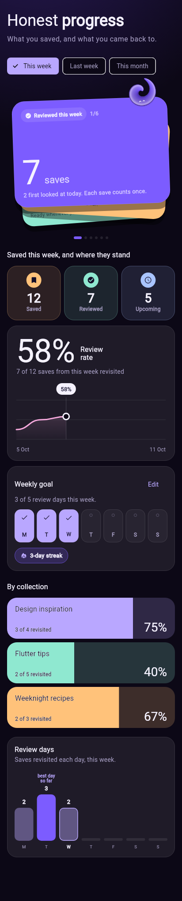
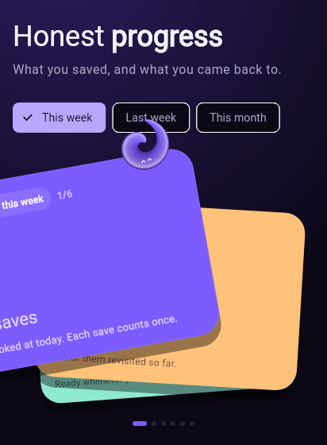
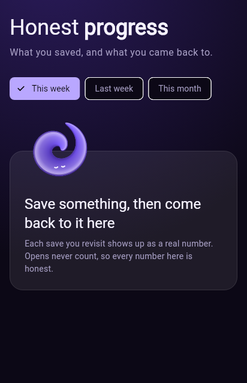
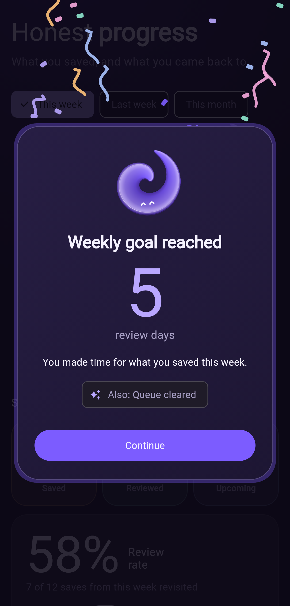

# Progress and celebration

The Progress tab and the milestone celebration. The PNGs are Flutter
widget-test renders of the shipping widgets with a sample report (Roboto
instead of Outfit, as in `docs/ribbon-spirit/`), not design mockups.

| | |
| --- | --- |
|  |   |



Under reduced motion the celebration is the same card without confetti or
the scale-in ([celebration-reduced.png](celebration-reduced.png)), and the
card deck is a flat page view.

## What the numbers mean

`progress.report(ProgressQuery)` (`pinne_server/lib/src/progress/`) reports
a save cohort: items saved from the start date (inclusive) to the end date
(exclusive), local to the device's current UTC offset. Archived items stay in
it. An item is reviewed once, by its first valid reviewed, completed or
applied event; opens and undone events never count.

- **Reviewed / Upcoming / Review rate**: cohort items reviewed to date, not
  yet reviewed, and reviewed ÷ saved. The rate is null, shown as "—", for
  an empty cohort.
- **Reviewed this week** (hero card): distinct items, from any cohort, with a
  review during the period.
- **Review days and weekly goal**: distinct local days with a review, from
  each event's effective local date. The goal (1–7 days, default 3) and the
  opt-in streak are `progress.settings` / `progress.updateSettings`.
- **Milestones**: first review, 10/25/50/100 reviews, the weekly goal for
  the current week, and a cleared review queue (today had a review and
  nothing is due, with reminders on). `progress.markCelebrated` stores seen
  keys in `celebration_seen`, so each one celebrates exactly once. The app
  marks them before showing the sheet, after Today's Reviewed or when
  Progress opens.

The current offset applies to the whole period, so a DST change inside a
month can move a save made within an hour of midnight to the next day.

## Reproduce the renders

From `pinne_flutter/`:

```sh
flutter test test/progress_goldens_test.dart --update-goldens
```
