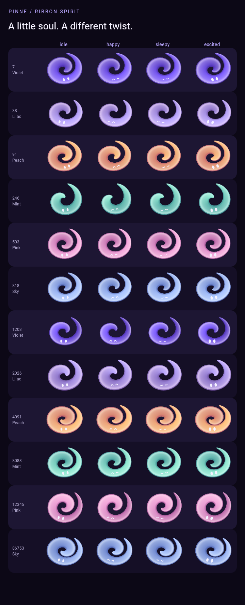
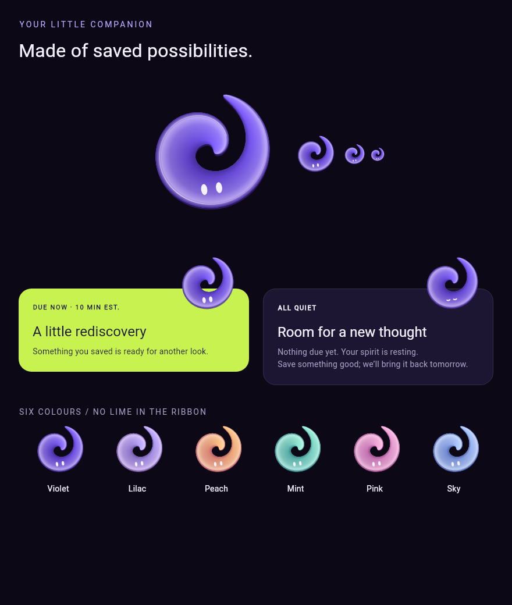
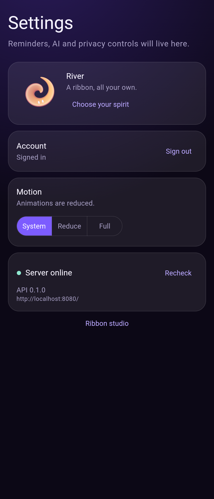
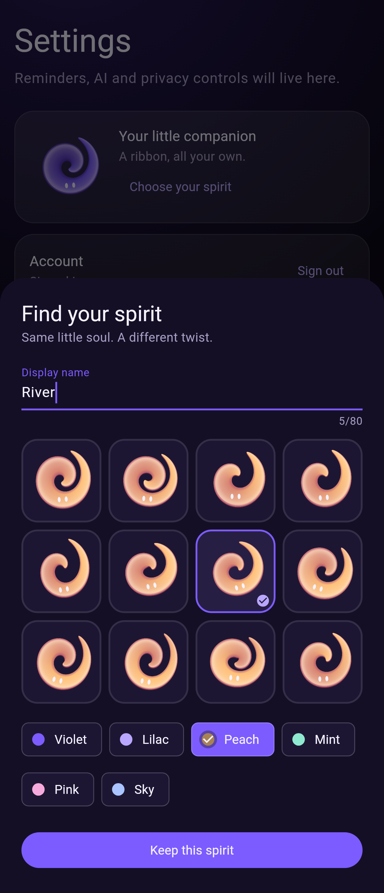

# Ribbon Spirit

A code-drawn satin ribbon with two eyes. No image assets, Rive files or art
service is involved. The PNGs here are Flutter widget-test renders of the
shipping painter and widgets, not design mockups.









## Use and review

```dart
RibbonSpirit(seed: 2026, palette: 0, mood: RibbonMood.excited, size: 126)
```

`animate: false` makes a still thumbnail. The widget reads the app's
`reduceMotionOf(context)` (`lib/ui/motion.dart`); reduced motion freezes the body and only the eyes
express the mood. With motion enabled, idle breathes and blinks, happy opens
with a settling spring, sleepy loosely coils, and excited curls quickly and
bounces. All loops sit inside a `RepaintBoundary`.

Debug builds expose `/debug/ribbon-spirit` through **Settings → Ribbon studio**.
It shows twelve seeds across all six palettes and four moods, plus one live
hero. Tap a row to give the hero that identity, then switch its mood. The
comparison grid stays still. A shared slot limits all eligible spirits to one
loop; visibility, route ticker state and app lifecycle release the slot.

Settings has a twelve-seed picker and palette chips. `profile.get` and
`profile.upsert(ProfileDraft)` persist the display name and recipe. The server
owns identity, requires authentication and atomically upserts on the unique
owner index. Empty names, names longer than 80 characters, palette indices
outside 0–5 and seeds outside 0–2147483646 are rejected. Until a profile is
saved, `RibbonRecipe.seedForUser` deterministically derives a seed from the
authenticated user id. Signing out or switching accounts invalidates it.

Today reads the real owner-scoped queue from `todayQueueProvider`. A due item
has a lime card and an excited spirit, floating gently together unless motion
is reduced. The empty queue uses a dark card and a sleepy spirit. The spirit
itself never uses lime.

## Stable recipes

`lib/ui/ribbon_spirit/ribbon_recipe.dart` is the recipe contract. Its integer
PRNG and user-id hash stay within JavaScript's exact integer range. They do not
use `Random` or `String.hashCode`. Seed controls curl count, thickness, tilt,
gradient lighting direction and aspect. Changing the algorithm changes saved
avatars, so preserve it or introduce an explicit recipe version in a future
migration.

Palette wire indices live in `PinneSpiritPalettes` in the app's design tokens:
0 violet, 1 lilac, 2 peach, 3 mint, 4 pink, 5 sky. Keep the server's
`ProfileEndpoint.paletteCount` aligned and append rather than reorder.

## Reproduce the renders

From `pinne_flutter/` on Flutter 3.47.3 / Dart 3.13.3:

```sh
flutter test test/ribbon_goldens_test.dart test/profile_avatar_test.dart --update-goldens
flutter test
flutter analyze
```

The gallery uses the Flutter SDK's Roboto font for portable test rendering;
the running app keeps its Outfit / Plus Jakarta Sans theme. The screenshot
palette, ribbon geometry and Today card widgets are the app's real code.
Golden comparisons run in the normal test suite. There is no runtime font or
image download for the spirit.

The first render had visibly faceted highlights. The next pass smoothed the
path sampling and broadened the ribbon; the final pass softened its lighting
into satin and used shared vertices to remove seams between gradient sections. Each pass was rendered and inspected before accepting the goldens.

Server checks run from `pinne_server/`:

```sh
serverpod generate
dart analyze
dart test
```

The tests exercise palette limits, owner separation, authentication and a real
PostgreSQL save/update/reload. App tests cover deterministic pixels, all four
reduced-motion faces, a single visible loop, ticker/scroll/background pausing,
and picker save/reload after disposing the entire provider tree, including a
failed-save retry state.

No mobile device or Chrome is available in this codespace. These are software
widget-test renders; Android/iOS visual review, Impeller rendering and physical
device frame-time profiling remain unrun.
